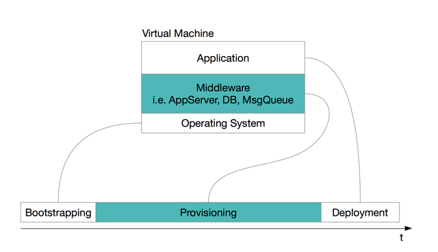

Part 2 - Infrastructure as Code
{.lead}

<h2>Introduction to Infrastructure Development</h2>

Infrastructure is the Runtime Environment of an (often distributed) Application. It consists of a set of interconnected machines, either physical or virtualized like KVM VMs or Docker Containers. The VM Creation Process from "Scratch" to "Deployed Application" can be seen as a three step process: Bootstrapping + Provisioning + App Deployment.
During Bootstrapping a set of empty VMs are being created and the basic network setup is done. Bootstrapping is finished when all the boxes have a distinct hostnames and are accessible via ssh or similar.
In the next phase this empty boxes will get provisioned with the "right" middleware to fulfill their role in the runtime environment for the later deployed app. Typical server roles are database host, a java based microservice container, a message queue instance etc.
There are a handful of mature provisioning frameworks on the market: Chef, Puppet, Ansible, Salt Stack, etc.
In this Workshop we focus on Chef and its tool ecosystem.  

[Chef Documentation][chef_doc]{: .btn .btn-xs .btn-default role=button }

<h2>3 Phase VM Creation Process</h2>

--

<h2>Heading</h2>

Text

[Link][commit_stage]{: .btn .btn-xs .btn-default role=button }

<h2>Heading</h2>

Text.

[Link][binary_repo]{: .btn .btn-xs .btn-default role=button }

<h2>Pipelines for Infrastructure</h2>

Colaborative work on infrastructure code requires a comparable set of engineering practices as software development itself: Continuous Integration, TDD, etc. Using tools like [rubocop][rubocop] and [testkitchen][testkitchen] make it easy to setup a build and testpipeline for cookbooks. The [commit stage][iac_commit_stage] produces a reusable binary artifact and runs static code analysis using [rubocop][rubocop]. The [acceptance test stage][iac_acceptance_test_stage] runs [serverspec][serverspec] or [bats][bats] test to ensure that the infrastructure is working as expected.

[Commit Stage][iac_commit_stage]{: .btn .btn-xs .btn-default role=button }
[Acceptance Test Stage][iac_acceptance_test_stage]{: .btn .btn-xs .btn-default role=button }
[Rubocop][rubocop]{: .btn .btn-xs .btn-default role=button }
[Testkitchen][testkitchen]{: .btn .btn-xs .btn-default role=button }
[Serverspec][serverspec]{: .btn .btn-xs .btn-default role=button }
[Bats][bats]{: .btn .btn-xs .btn-default role=button }

<h2>Provisioning complex Environments</h2>

If you try to describe a whole environment with tools like [Chef][chef_doc] you need a possibility to define server roles in that environment. An easy way to do this is to use the [environment cookbook pattern][env_cookbook_pattern]: Every recipe in an environment cookbook describes one role in an environment (e.g: [jkmaster][env_ws_pipeline_jkmaster]) and therefore combines functionality from several application cookbooks. The dependencies to the application cookbook are defined in the [metadata.rb][env_ws_pipeline_metadata] and all the versions are pinned there. Applying a fixed version of an environment cookbook (with all its pinned dependencies) to a set of virtual machines creates a certain, reproducible state of a whole environment.

[Chef][chef_doc]{: .btn .btn-xs .btn-default role=button }
[Environment Cookbook Pattern][env_cookbook_pattern]{: .btn .btn-xs .btn-default role=button }
[Jkmaster Role][env_ws_pipeline_jkmaster]{: .btn .btn-xs .btn-default role=button }
[Env Cookbook Metadata][env_ws_pipeline_metadata]{: .btn .btn-xs .btn-default role=button }

